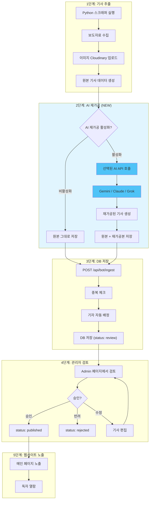
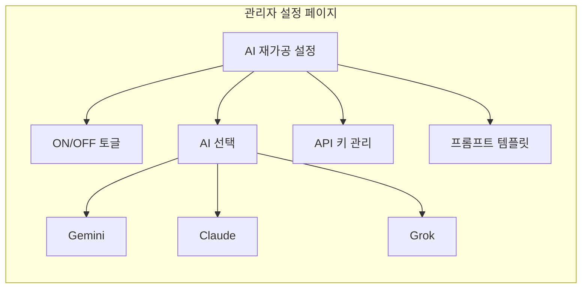
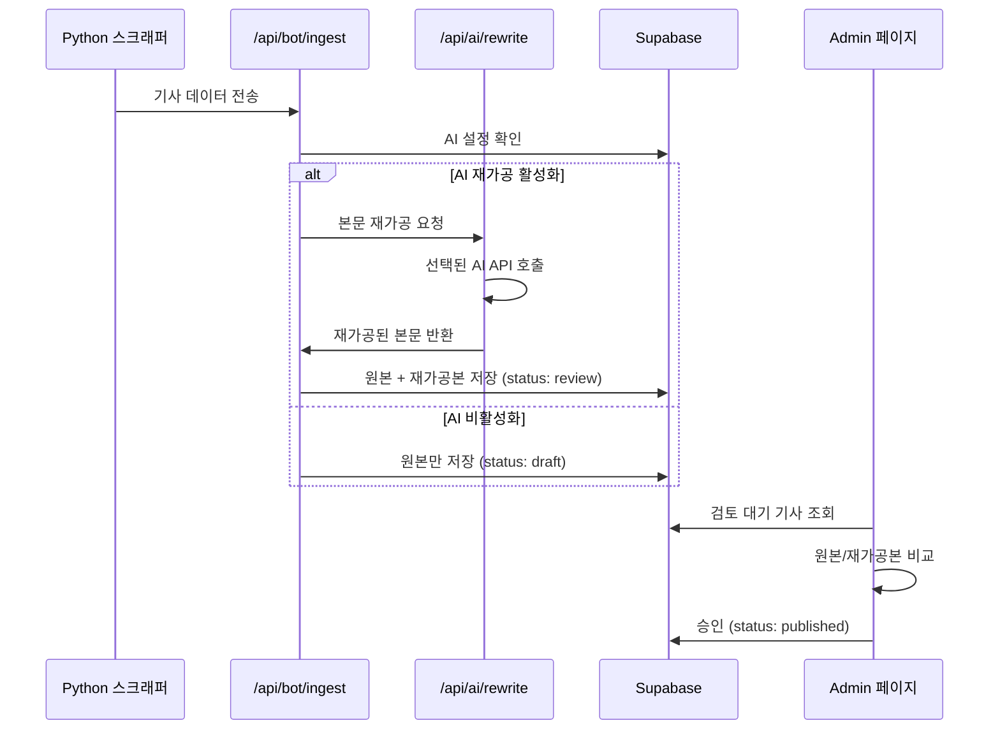

# AI 기사 재가공 기능 - 전체 흐름도

> **목표**: 스크래퍼 추출 후 AI API를 통해 기사를 재가공하여 품질 향상
> 
> **작성일**: 2025-12-22

---

## 1. 전체 파이프라인 흐름도



---

## 2. 관리자 설정 화면 구성



### 2.1 필요한 설정 항목

| 항목 | 설명 | 저장 위치 |
|------|------|----------|
| **AI 재가공 ON/OFF** | 기능 활성화 여부 | `site_settings` 테이블 |
| **기본 AI 선택** | Gemini / Claude / Grok | `site_settings` 테이블 |
| **API 키** | 각 AI별 API 키 | `.env` 또는 DB (암호화) |
| **프롬프트 템플릿** | 재가공용 프롬프트 | `ai/article_rewriter_prompt.md` |

---

## 3. 신규 개발 필요 항목

### 3.1 백엔드 (API)

| API | 메서드 | 용도 |
|-----|--------|------|
| `/api/ai/rewrite` | POST | AI 기사 재가공 실행 |
| `/api/admin/ai-settings` | GET/PATCH | AI 설정 조회/수정 |

### 3.2 프론트엔드 (Admin 페이지)

| 페이지 | 경로 | 용도 |
|--------|------|------|
| **AI 설정** | `/admin/settings/ai` | AI 선택, API 키, 프롬프트 관리 |
| **기사 검토** | `/admin/news` (기존 수정) | 원본/재가공본 비교 보기 |

### 3.3 데이터베이스 (스키마 변경)

| 테이블 | 컬럼 | 타입 | 설명 |
|--------|------|------|------|
| `posts` | `original_content` | text | 원본 본문 (스크래퍼 추출) |
| `posts` | `content` | text | 재가공 본문 (AI 처리) |
| `posts` | `ai_provider` | text | 사용된 AI (gemini/claude/grok) |
| `posts` | `ai_processed_at` | timestamp | AI 처리 시간 |
| `site_settings` | `ai_rewrite_enabled` | boolean | 재가공 활성화 여부 |
| `site_settings` | `ai_default_provider` | text | 기본 AI 선택 |

---

## 4. 상세 처리 흐름



---

## 5. UI 목업 (Admin AI 설정)

```
+-------------------------------------------------------------+
|  [Settings] AI 기사 재가공 설정                              |
+-------------------------------------------------------------+
|                                                              |
|  [1] 재가공 활성화                                           |
|  +--------------------------------------------------------+ |
|  |  [v] AI 기사 재가공 사용                               | |
|  +--------------------------------------------------------+ |
|                                                              |
|  [2] AI 선택                                                 |
|  +--------------------------------------------------------+ |
|  |  (*) Gemini    ( ) Claude    ( ) Grok                  | |
|  +--------------------------------------------------------+ |
|                                                              |
|  [3] API 키 설정                                             |
|  +--------------------------------------------------------+ |
|  |  Gemini API Key:  [****************] [테스트]          | |
|  |  Claude API Key:  [****************] [테스트]          | |
|  |  Grok API Key:    [****************] [테스트]          | |
|  +--------------------------------------------------------+ |
|                                                              |
|  [4] 프롬프트 템플릿                                         |
|  +--------------------------------------------------------+ |
|  |  +--------------------------------------------------+  | |
|  |  | 너는 20년 경력의 지역 일간지 편집국장이야...     |  | |
|  |  | ...                                               |  | |
|  |  +--------------------------------------------------+  | |
|  +--------------------------------------------------------+ |
|                                                              |
|                              [저장] [취소]                   |
+-------------------------------------------------------------+
```

---

## 6. UI 목업 (기사 검토 - 비교 보기)

```
+-------------------------------------------------------------+
|  [Review] 기사 검토 - 비교 보기                              |
+-------------------------------------------------------------+
|                                                              |
|  제목: 광주광역시, 2025년 청년 일자리 정책 발표              |
|  출처: 광주광역시  |  AI: Gemini  |  처리: 2025-12-22 10:30  |
|                                                              |
|  +---------------------+  +---------------------+           |
|  | [Original]          |  | [AI Rewritten]      |           |
|  | 원본 (보도자료)      |  | AI 재가공본         |           |
|  +---------------------+  +---------------------+           |
|  | 광주광역시는 12월    |  | 광주광역시가 청년   |           |
|  | 20일 청년 일자리     |  | 일자리 창출을 위한  |           |
|  | 확대를 위한 정책을   |  | 새로운 정책을       |           |
|  | 발표했다. 담당부서   |  | 발표했다.           |           |
|  | 는 일자리정책과이며  |  |                     |           |
|  | ...                  |  | 이번 정책은 청년    |           |
|  |                      |  | 5000명에게 직접적   |           |
|  |                      |  | 혜택을 제공할...    |           |
|  +---------------------+  +---------------------+           |
|                                                              |
|  [원본 사용] [AI본 사용] [직접 편집] [반려]                  |
|                                                              |
+-------------------------------------------------------------+
```

---

## 7. 개발 우선순위 (제안)

| 순서 | 작업 | 난이도 | 예상 시간 |
|------|------|--------|----------|
| 1 | DB 스키마 변경 (`posts` 컬럼 추가) | ⭐ | 30분 |
| 2 | `/api/ai/rewrite` API 개발 | ⭐⭐⭐ | 2시간 |
| 3 | `/admin/settings/ai` 설정 페이지 | ⭐⭐ | 1시간 |
| 4 | `/api/bot/ingest` AI 연동 수정 | ⭐⭐ | 1시간 |
| 5 | 기사 검토 UI 수정 (비교 보기) | ⭐⭐ | 1시간 |
| 6 | 테스트 및 검증 | ⭐⭐ | 1시간 |

**총 예상 개발 시간**: 약 6~7시간

---

## 8. 다음 단계

주인님께서 이 흐름도를 검토하신 후:

1. **승인** → 세부 implementation_plan.md 작성 진행
2. **수정 요청** → 흐름도 업데이트
3. **추가 논의** → 특정 부분 상세 설계

---

*작성자: Gemini (Antigravity)*
*Korea NEWS AI 기사 재가공 기능 설계 문서*
