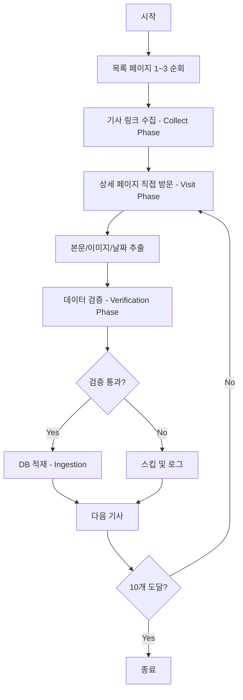

# 광주광역시 스크래퍼 알고리즘 문서
> **파일:** `gwangju_scraper.py`  
> **버전:** v3.0 (Stability & Verification)  
> **최종 수정:** 2025-12-11

---

## 📋 개요

| 항목 | 값 |
|------|-----|
| **대상 사이트** | https://www.gwangju.go.kr |
| **수집 대상** | 보도자료 게시판 (BD_0000000027) |
| **Region Code** | `gwangju` |
| **Category** | `광주` |

---

## 🔄 동작 흐름 (Algorithm Flow)



---

## 📌 핵심 함수별 설명

### 1. `collect_articles(days=3)`
**메인 수집 함수**

```python
# 1단계: Collect Phase - 링크 수집
for page_num in range(1, 4):  # 1~3페이지 순회
    # 목록 페이지에서 모든 기사 링크 추출
    # 선택자: 'tr td.title a', 'a[href*="boardView.do"]'

# 2단계: Visit Phase - 상세 페이지 방문
for item in collected_links[:10]:  # 최대 10개 제한
    fetch_detail(page, url)  # 본문/이미지/날짜 추출

# 3단계: Verification Phase - 엄격한 검증
validate_article(article_data)

# 4단계: Ingestion - DB 적재
send_article_to_server(article_data)
```

### 2. `fetch_detail(page, url)`
**상세 페이지에서 데이터 추출**

| 추출 항목 | 선택자 | 설명 |
|-----------|--------|------|
| **본문** | `div.board_view_body`, `div.view_content`, `div#boardView` | 첫 번째 매칭 사용 |
| **이미지** | 본문 내 `img` 태그 | `icon`, `button` 제외 후 첫 번째 이미지 |
| **날짜** | `span:has-text("등록일")`, `li:has-text("등록일")` | 정규식으로 YYYY-MM-DD 추출 |

### 3. `validate_article(article_data)`
**엄격한 검증 로직**

| 검증 항목 | 조건 | 실패 시 |
|-----------|------|---------|
| 제목 | 5자 이상 | 스킵 |
| 본문 | 50자 이상 | 스킵 |
| 본문 에러 | "본문 내용을 가져올 수 없습니다" 포함 불허 | 스킵 |
| 이미지 URL | `http`로 시작해야 함 | 스킵 |

### 4. `normalize_date(date_str)`
**날짜 정규화**

- 입력: `2024.12.10`, `2024/12/10`, `등록일: 2024-12-10`
- 출력: `2024-12-10` (YYYY-MM-DD 형식)

---

## ⚙️ 설정값 (Constants)

```python
REGION_CODE = 'gwangju'
REGION_NAME = '광주광역시'
CATEGORY_NAME = '광주'
BASE_URL = 'https://www.gwangju.go.kr'
LIST_URL = 'https://www.gwangju.go.kr/boardList.do?boardId=BD_0000000027&pageId=www789'
```

---

## 📁 의존성 (Dependencies)

```python
from utils.api_client import send_article_to_server, log_to_server
from utils.scraper_utils import safe_goto, wait_and_find, safe_get_text, safe_get_attr
```

---

## 🚨 주의사항

1. **핫링크 방지:** 광주시 서버는 외부에서 이미지 직접 접근을 차단함  
   → 스크래핑 시 이미지를 로컬에 다운로드 후 Cloudinary 업로드 필요

2. **처리 제한:** 현재 1회 실행 시 최대 10개 기사만 처리 (안정화 목적)

3. **부하 조절:** 각 기사 처리 후 `time.sleep(1)` 적용

---

## 🧪 실행 방법

```bash
# 기본 실행
python gwangju_scraper.py

# 최근 N일 기사 수집
python gwangju_scraper.py --days 7

# 드라이런 (DB 적재 없이 테스트)
python gwangju_scraper.py --dry-run
```

---

## 📊 마지막 검증 결과 (2025-12-11)

- **처리:** 10건
- **DB 저장 성공:** 9건
- **실패 원인:** 본문 추출 실패 1건
