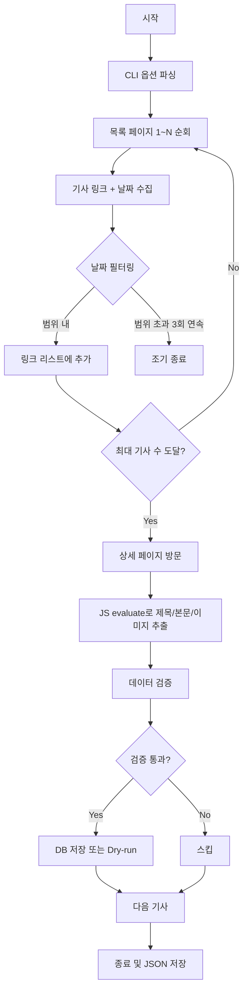

# 광주시교육청 스크래퍼 알고리즘 문서
> **파일:** `gwangju_edu_scraper.py`  
> **버전:** v4.0 (Hybrid - CLI + Playwright)  
> **최종 수정:** 2025-12-11

---

## 📋 개요

| 항목 | 값 |
|------|-----|
| **대상 사이트** | https://enews.gen.go.kr |
| **수집 대상** | 홍보관 보도자료 (sid=25) |
| **Region Code** | `kedu` |
| **Category** | `광주교육청` |

---

## 🆕 v4.0 하이브리드 특징

| 출처 | 가져온 기능 |
|------|-------------|
| **JS/Puppeteer 코드** | CLI 옵션, 날짜 필터링, 조기 종료 최적화 |
| **Python v3.1** | Playwright, Supabase API, Cloudinary 업로드 |

---

## 🔄 동작 흐름 (Algorithm Flow)



---

## 📌 CLI 옵션

```bash
# 기본 실행 (3페이지, 12개)
python gwangju_edu_scraper.py

# 특정 날짜만
python gwangju_edu_scraper.py --exact-date 2025-12-11

# 날짜 범위
python gwangju_edu_scraper.py --start-date 2025-12-01 --end-date 2025-12-11

# 페이지/기사 수 조절
python gwangju_edu_scraper.py --max-pages 5 --max-articles 30

# 드라이런 + JSON 출력
python gwangju_edu_scraper.py --max-articles 3 --dry-run --output result.json
```

---

## 🔍 핵심 셀렉터

| 항목 | 셀렉터 | 설명 |
|------|--------|------|
| **목록** | `a[href*='wbb=md:view;uid:']` | 기사 링크 직접 선택 (ul/li 아님) |
| **제목** | `div.view_top` 내 텍스트 | JS evaluate로 메타정보 제외 |
| **본문** | `div.board_press` | JS evaluate로 불필요 요소 제거 |
| **이미지** | `file_download('uid')` 패턴 | 첨부파일 다운로드 링크 파싱 |

---

## 📁 이미지 처리

이 사이트는 이미지를 `` 태그가 아닌 **첨부파일 다운로드 링크**로 제공합니다.

```javascript
// 패턴
<a href="javascript:file_download('274997');">[사진] 행사.jpg</a>

// 다운로드 URL 생성
https://enews.gen.go.kr/v5/decoboard/download.php?uid=274997
```

→ Cloudinary 업로드 후 URL 저장

---

## ⚙️ 설정값 (Constants)

```python
REGION_CODE = 'kedu'
REGION_NAME = '광주시교육청'
CATEGORY_NAME = '광주교육청'
BASE_URL = 'https://enews.gen.go.kr'
LIST_URL = 'https://enews.gen.go.kr/v5/?sid=25'
```

---

## 📁 파일 구조

```
scrapers/gwangju_edu/
├── gwangju_edu_scraper.py        # v4.0 메인 (Hybrid)
├── gwangju_edu_scraper_old.py    # v3.1 백업
├── gwangju_edu_scraper_v5_pyppeteer.py  # Pyppeteer 버전 (미사용)
├── ALGORITHM.md                   # 이 문서
├── test_results/                  # 테스트 결과
├── fix_wrong_titles.py           # 제목 수정 유틸
└── update_existing_posts.py      # 기존 게시물 업데이트
```

---

## 🚨 특이사항

1. **목록 구조 특수성**  
   일반적인 `<ul><li>` 구조가 아니라 `<a>` 태그가 직접 나열됨

2. **제목 추출 어려움**  
   제목이 별도 태그 없이 `div.view_top` 텍스트에 포함됨  
   → 메타정보(작성일, 조회수 등) 제외 로직 필요

3. **이미지 첨부파일 방식**  
   `file_download()` JavaScript 함수로 다운로드  
   → JS evaluate로 UID 추출 후 다운로드 URL 생성

4. **날짜 필터링**  
   연속 3페이지 빈 결과 시 조기 종료 (효율화)

---

## 📊 v4.0 테스트 결과 (2025-12-11)

| 지표 | 결과 |
|------|------|
| 목록 수집 | 8개 발견 |
| 상세 수집 | 3개 성공 |
| 소요 시간 | 25.31초 |
| 이미지 추출 | ✅ 성공 |
