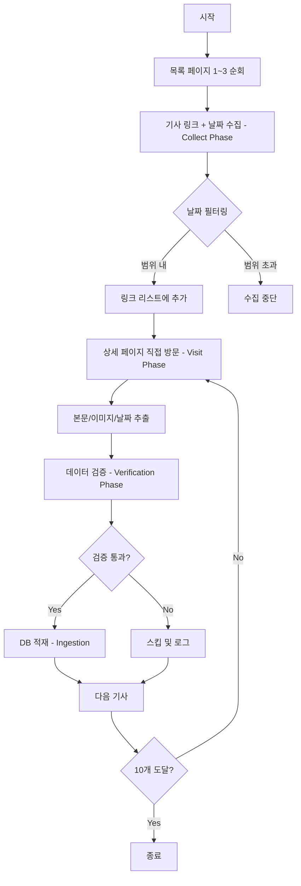

# 전라남도청 스크래퍼 알고리즘 문서
> **파일:** `jeonnam_scraper.py`  
> **버전:** v3.0 (Stability & Verification)  
> **최종 수정:** 2025-12-11

---

## 📋 개요

| 항목 | 값 |
|------|-----|
| **대상 사이트** | https://www.jeonnam.go.kr |
| **수집 대상** | 보도자료 게시판 (menuId=jeonnam0202000000) |
| **Region Code** | `jeonnam` |
| **Category** | `전남` |

---

## 🔄 동작 흐름 (Algorithm Flow)



---

## 📌 핵심 함수별 설명

### 1. `collect_articles(days=3)`
**메인 수집 함수**

```python
# Phase 1: Collect Phase - 링크 수집
for page_num in range(1, 4):  # 1~3페이지 순회
    # 목록 페이지에서 모든 기사 링크 추출
    # 선택자: 'tbody tr' → 'td.title a'
    # 날짜 필터링: start_date ~ end_date 범위 내만 수집

# Phase 2: Visit Phase - 상세 페이지 방문
for item in collected_links[:10]:  # 최대 10개 제한
    fetch_detail(page, url)  # 본문/이미지/날짜 추출

# Phase 3: Verification Phase - 엄격한 검증
validate_article(article_data)

# Phase 4: Ingestion - DB 적재
send_article_to_server(article_data)
```

### 2. `fetch_detail(page, url)`
**상세 페이지에서 데이터 추출**

| 추출 항목 | 선택자 | 설명 |
|-----------|--------|------|
| **본문** | `div.bbs_view_contnet`, `div.preview_area`, `div.bbs_view`, `div.contents` | 첫 번째 50자 이상 매칭 사용 |
| **이미지 (우선)** | `a[href*="boardDown.do"]` + 확장자 검사 | 첨부파일에서 이미지 추출 |
| **이미지 (fallback)** | 본문 내 `img` 태그 | `icon`, `button` 제외 |
| **날짜** | `span:has-text("등록일")`, `li:has-text("등록일")`, `td.date` | 정규식으로 YYYY-MM-DD 추출 |

### 3. `validate_article(article_data)`
**엄격한 검증 로직 (광주와 동일)**

| 검증 항목 | 조건 | 실패 시 |
|-----------|------|---------|
| 제목 | 5자 이상 | 스킵 |
| 본문 | 50자 이상 | 스킵 |
| 본문 에러 | "본문 내용을 가져올 수 없습니다" 포함 불허 | 스킵 |
| 이미지 URL | `http`로 시작해야 함 | 스킵 |

---

## ⚙️ 설정값 (Constants)

```python
REGION_CODE = 'jeonnam'
REGION_NAME = '전라남도'
CATEGORY_NAME = '전남'
BASE_URL = 'https://www.jeonnam.go.kr'
LIST_URL = 'https://www.jeonnam.go.kr/M7116/boardList.do?menuId=jeonnam0202000000'
```

---

## 📁 의존성 (Dependencies)

```python
from utils.api_client import send_article_to_server, log_to_server
from utils.scraper_utils import safe_goto, wait_and_find, safe_get_text, safe_get_attr
```

---

## 🆕 v3.0 변경사항 (vs v2.1)

| 항목 | v2.1 | v3.0 |
|------|------|------|
| **내비게이션** | 목록→상세→목록 (비효율) | Collect & Visit (효율적) |
| **검증** | 없음 | Strict Verification |
| **에러 처리** | 기본 | try-except 강화 |
| **처리 제한** | 없음 | 10개/회 (안정화) |

---

## 🧪 실행 방법

```bash
# 기본 실행
python jeonnam_scraper.py

# 최근 N일 기사 수집
python jeonnam_scraper.py --days 7

# 드라이런 (DB 적재 없이 테스트)
python jeonnam_scraper.py --dry-run
```

---

## 🚨 특이사항

1. **HWP iframe 대응:** 일부 기사는 HWP 문서가 iframe으로 표시되어 본문 추출이 어려울 수 있음
2. **첨부파일 이미지:** `boardDown.do` 링크에서 .jpg/.png 확장자를 찾아 이미지 추출
3. **날짜 필터링:** 목록 페이지에서 먼저 날짜 확인 후 범위 외 기사는 수집하지 않음
