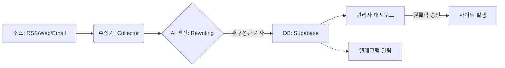

# 뉴스 수집 및 자동화 봇(Bot) 상세 설계서

## 1. 시스템 개요 (System Overview)
- **명칭:** Korea News Automation Bot (K-Bot)
- **목적:** 365일 24시간 쉬지 않고 뉴스 소스(RSS, 이메일, 웹사이트)를 감시하고, 이를 수집/가공하여 기사 초안(Draft)을 생산함.
- **핵심 철학:** "단순 수집이 아닌, **가치 있는 재창조(Rewriting)**"

## 2. 기술 아키텍처 (Tech Architecture)
> *가볍고 빠르며 유지보수가 쉬운 구조*

### A. 기술 스택
- **Language:** Python 3.11 (데이터 처리에 최적화)
- **Database:** Supabase (PostgreSQL) - 기사 저장 및 관리
- **AI Engine:** OpenAI GPT-4o (번역, 요약, 재구성 담당)
- **Scheduling:** GitHub Actions (서버리스 주기적 실행) + 로컬 스케줄러

### B. 모듈 구성
1.  **Collectors (수집기)**
    - `rss_collector.py`: 해외 뉴스(TechCrunch 등) RSS 피드 감지.
    - `imap_monitor.py`: 이메일(보도자료) 수신 감지 및 첨부파일 파싱.
    - `web_scraper.py`: RSS가 없는 국내 사이트(AI타임스 등) 크롤링.
2.  **processors (가공기)**
    - `ai_rewriter.py`: 수집된 원문의 팩트를 추출하여 "코리아NEWS" 문체로 다시 쓰기.
    - `translator.py`: 영어 -> 한국어 번역 및 맥락 해설 추가.
3.  **Publisher (발행기)**
    - `db_loader.py`: 가공된 기사를 Supabase DB의 `posts` 테이블에 적재. (상태: `draft` or `published`)
    - `telegram_notifier.py`: **[NEW]** "기사 수집 완료 (3건)" 메시지를 발행인의 폰으로 전송.

## 3. 데이터 처리 흐름 (Data Flow)

## 4. 운영 시나리오 (Operation Manual)

### 상황 1: 밤새 해외에서 중요한 AI 뉴스가 떴을 때
1.  **[04:00]** `rss_collector`가 TechCrunch RSS에서 새 기사 감지.
2.  **[04:01]** AI가 즉시 한국어로 번역하고, "국내 교육계에 미칠 영향" 한 줄 논평 추가.
3.  **[04:02]** DB에 '해외토픽' 카테고리로 저장.
4.  **[07:00]** 발행인 기상 후 스마트폰으로 확인 -> **[승인]** 클릭 -> 메인 페이지 노출.

### 상황 2: 시청에서 보도자료 메일이 왔을 때
1.  **[14:00]** 광주시청 공보관실에서 `press@koreanews.com`으로 HWP 보도자료 발송.
2.  **[14:01]** `imap_monitor`가 메일 수신 확인. 첨부파일(HWP) 텍스트 추출.
3.  **[14:02]** AI가 "건조한 보도자료 어조"를 "신문 기사체"로 변환 (제목, 리드문 작성).
4.  **[14:03]** 관리자 페이지에 **[발행 대기]** 알림 뜸.

## 5. 개발 우선순위
1.  **1단계:** 해외 RSS 수집기 (가장 쉽고 효과 큼)
2.  **2단계:** 이메일 보도자료 처리기 (핵심 기능)
3.  **3단계:** 국내 사이트 스크래퍼 (보조 기능)
